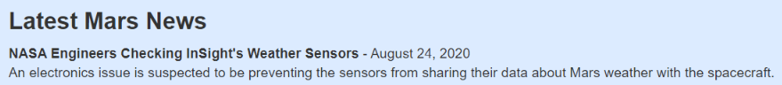
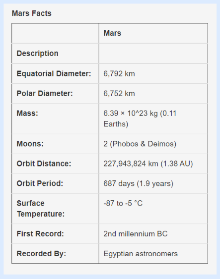
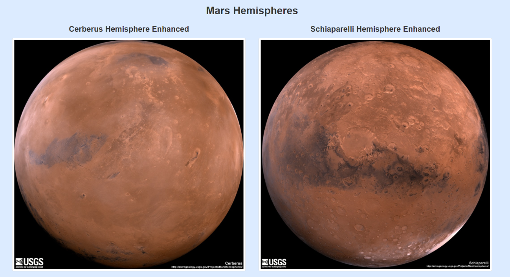

# Mission to Mars
Thanks for checking out my project's repo! By downloading this repo, you'll be able to scrape various websites for current data related to the Mission to Mars!

<!-- TABLE OF CONTENTS -->
## Table of Contents

* [About the Project](#about-the-project)
  * [Built With](#built-with)
* [Project Instructions](#project-instructions)

<!--About the Project-->
## About the Project
First, my web application will scrape the latest news title, paragraph text, and date from the [ NASA Mars News Site ](https://mars.nasa.gov/news/?page=0&per_page=40&order=publish_date+desc%2Ccreated_at+desc&search=&category=19%2C165%2C184%2C204&blank_scope=Latest). Here is an example:  
 

Next, it will scrape the [ JPL Featured Space Image ](https://www.jpl.nasa.gov/spaceimages/?search=&category=Mars). Here is an example:  
 

Next, my web application will scrape [ Mars facts ](https://space-facts.com/mars/) and store them into a table. Here is an example:  
 

Next, it will scrape images of [ Mars' hemispheres ](https://astrogeology.usgs.gov/search/results?q=hemisphere+enhanced&k1=target&v1=Mars). Here is an example of two of the hemispheres:  
 

Finally, my web application will render all of this information on a single HTML page.

<!--Built With-->
### Built With
This project was built using the following frameworks/libraries: 
* Python 
* Pandas
* Splinter
* Beautiful Soup 
* Flask Pymongo
* Requests
* Flask
* Bootstrap
* HTML
* CSS

<!--Project Instructions-->
## Project Instructions

In this assignment, you will build a web application that scrapes various websites for data related to the Mission to Mars and displays the information in a single HTML page. The following outlines what you need to do. 

### Step 1 - Scraping
* Complete your initial scraping using Jupyter Notebook, BeautifulSoup, Pandas, and Requests/Splinter. 
* Create a Jupyter Notebook file called mission_to_mars.ipynb and use this to complete all of your scraping and analysis tasks. The following outlines what you need to scrape. 

#### NASA Mars News
* Scrape the NASA Mars News Site and collect the latest News Title and Paragraph Text. Assign the text to variables that you can reference later. 

#### JPL Mars Space Images - Featured Image
* Visit the url for JPL Featured Space Image here. 
* Use splinter to navigate the site and find the image url for the current Featured Mars Image and assign the url string to a variable called featured_image_url. 
* Make sure to find the image url to the full size .jpg image. 
* Make sure to save a complete url string for this image. 

#### Mars Facts
* Visit the Mars Facts webpage here and use Pandas to scrape the table containing facts about the planet including Diameter, Mass, etc. 
* Use Pandas to convert the data to a HTML table string. 

#### Mars Hemispheres
* Visit the USGS Astrogeology site here to obtain high resolution images for each of Mar's hemispheres. 
* You will need to click each of the links to the hemispheres in order to find the image url to the full resolution image. 
* Save both the image url string for the full resolution hemisphere image, and the Hemisphere title containing the hemisphere name. Use a Python dictionary to store the data using the keys img_url and title. 
* Append the dictionary with the image url string and the hemisphere title to a list. This list will contain one dictionary for each hemisphere. 

### Step 2 - MongoDB and Flask Application
Use MongoDB with Flask templating to create a new HTML page that displays all of the information that was scraped from the URLs above. 
* Start by converting your Jupyter notebook into a Python script called scrape_mars.py with a function called scrape that will execute all of your scraping code from above and return one Python dictionary containing all of the scraped data. 
* Next, create a route called "/scrape" that will import your scrape_mars.py script and call your scrape function. 
  * Store the return value in Mongo as a Python dictionary. 
* Create a root route "/" that will query your Mongo database and pass the mars data into an HTML template to display the data. 
* Create a template HTML file called index.html that will take the mars data dictionary and display all of the data in the appropriate HTML elements. Use the following as a guide for what the final product should look like, but feel free to create your own design. 
